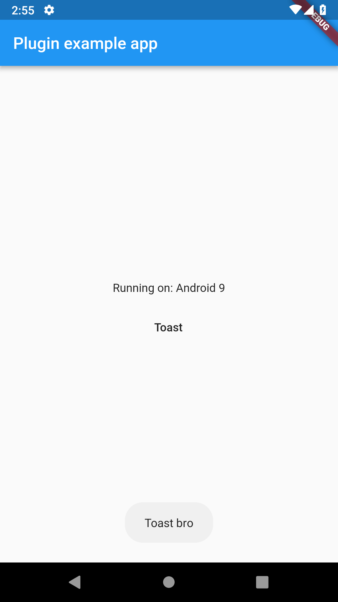
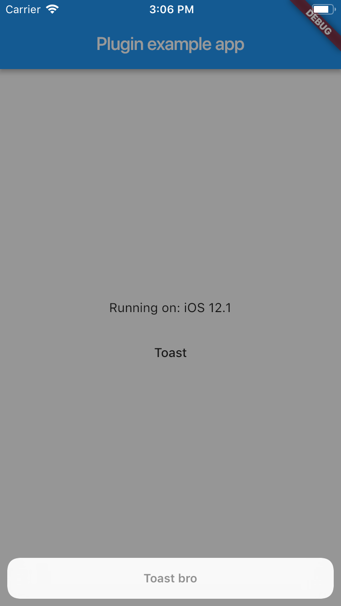

# toaster

A simple toast plugin for Android and iOS.

## Installation

Add `toaster: ^0.0.1` in your  `pubspec.yaml` dependencies

## How To Use

With this plugin, you can easily show toast on both Android (using Toast) and iOS (using actionSheet). Example:

```Toaster.toast(message: "Message", duration: Duration.SHORT);```

For a more detail example please take a look at the `example` folder.





